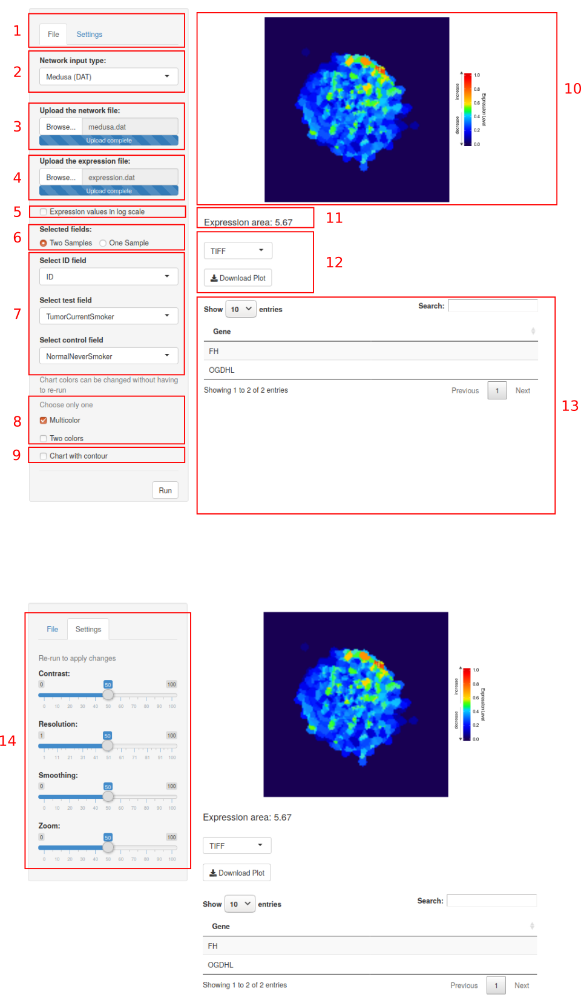

# Overview

The **levi (Landscape Expression Visualization Interface)** is a package for 
the R environment, developed to enable the visualization of the projection of 
gene expression on a biological network. 
**levi** is based on two other software, the first is the 
Viacomplex (@Castro2009), which was written in Fortran using the Dislin library 
to plot the data. The second is Galant (@Camilo2013), which corresponds to a 
plugin for Cytoscape software.


Two files are required to use **levi**: The file containing the expression 
levels of the genes and a file containing the biological network.

# Files
## Gene Expression Levels
This file should contain the genes of interest previously normalized by the 
user. The expression file 
(see [Example](https://bit.ly/2KSBaOo)) must have a column with the 
identification of genes (Gene Symbol, Entrez, etc.) and at least one column 
with gene expression levels (treatment, case, control, etc.).  The user can 
compare 
the expression levels between samples if  there are more columns containing 
these data.

If the expression file does not have values for all the genes of the network, 
a message will be displayed showing log file path to a temporary 
directory with the gene names. In the **landscape** construction, genes 
with no expression value will be displayed with values close to 0.5 
demonstrating that there were no changes (down-regulated or up-regulated genes).

Data sets of gene expression can be obtained from online databases:

* [Gene Expression Omnibus (GEO)](https://www.ncbi.nlm.nih.gov/geo/)
* [Array Express](https://www.ebi.ac.uk/arrayexpress/)
* [The Cancer Genome Atlas (TCGA)](https://cancergenome.nih.gov/)
* [Sequence Read Archive (SRA)](https://www.ncbi.nlm.nih.gov/sra)

## Biological Network

The **levi** supports several extensions of biological network files (\*.net, 
\*.dyn, \*.txt, \*.dat). The user should  build the biological network using 
specific tools such as: Cytoscape, RedeR, Medusa, etc. To build the biological 
network is recommended the obtention of interaction data/ biological 
associations from online repositories:

* [STRING database](https://string-db.org/)
* [StarBase](http://starbase.sysu.edu.cn/)
* [miRBase](http://www.mirbase.org/)
* [lncRNAdb](http://www.lncrnadb.org/)
* [HTRIdb](http://www.lbbc.ibb.unesp.br/htri)

|   Extension   | File Type |                 Link                          |
|:--------:|:---------------:|:---------------------------------------------:|
|   dat    |   Medusa (DAT)  | [Example DAT](https://bit.ly/2sj6RJh)         |
|   dyn    |    RedeR (DYN)  | [Example DYN](https://bit.ly/2IJGaZ7)         |
|   net    |    Pajek (NET)  | [Example NET](https://bit.ly/2IKzaLv)         |
|   stg    | STRING / STITCH | [Example coordinates](https://bit.ly/2xjnaLU) |
|   stg    | STRING / STITCH | [Example interactions](https://bit.ly/2J2OToH)|


#Viewing Modes

**levi** has two viewing modes: **Graphical User Interface (GUI)** 
and **script**.

## Graphical User Interface (GUI)

The GUI mode was developed using Shiny package (Figure 1).  This viewing mode
can be used in the R environment (browser=FALSE) or in the user's default 
operating system browser (browser=TRUE).

```{r eval=FALSE, fig.height=6, fig.width=6}
library(levi)
LEVIui(browser=TRUE)  #Launch Levi to Browser.
LEVIui(browser=FALSE) #Launch Levi to R environment.

```

<center></center>
<center> <b>Figure 2: </b> Graphical User Interface (GUI).</center>

* **1** - **Tabs**
    + **File** - General options for uploading the data files.
    + **Settings** - Options to build the **landscape**. 
* **2** - **Network input type:** - Selection of the biological network input 
format. The options are available on the table 1.
* **3** - **Upload the network file** - Input button to select the biological 
network file.
* **4** - **Upload the expression file** - Input button to select the gene 
expression levels file.
* **5** - **Expression values in log scale** - 
select when there is low variation between expression data
* **6** - **Selected fields** - Selecting the type of analysis. Comparison 
between two samples or a single sample.
* **7** - **Select gene symbol field** -  Selection of the gene ID contained 
in the gene expression levels file.  The gene ID in the biological network 
file must be the same in the gene expression levels file. **Select test field**
-  Select the case/test sample. **Select control field** - Select the 
control sample. If **levi** detects the case/test sample and control sample as
equal, then **levi** will apply the "single sample" analysis.
* **8** - **Chart Colors** - Color palette to build the **landscape**. There is 
two options the **Multicolor** has 20 color levels combined. The 
**Two colors** has two categories of color palettes, multicolor and two colors. 
For the selection of two colors the available options are: *purple_pink*, 
*green_blue*, *blue_yellow*, *pink_green*, *orange_purple*, *green_marine*. 
Both of them is targeted to show the biological network with higher expression. 
(Figure 3 and Figure 4).
* **9** - **Chart with contour** - Enable or disable the contour lines in 
the **landscape**.
* **10** -  **landscape** Image display area. The user can select specific 
areas of the image to inspect the gene name and position.
* **11** - **Expression area:** - Total expression value of the selected 
area in the image.
* **12** - **Download options**
    + **File format to landscape** - Select the output format of the
    **landscape**. The options available are: TIFF, BMP,  JPEG and PNG. We 
    recommend using this option in the browser.
    + **Download Plot** - Button to save the file.
* **13** -  Visualization of gene name and expression value of the selected 
area in the **landscape**. The user can save the table in a csv file 
(button **Download Data**)
* **14** - **Settings**
    + **Contrast** - Constrast value in the **landscape**. The variable 
    range is 1 to 100. The default value is 50.
    + **Resolution** -  Image  size of the **landscape**. The variable 
    range is 1 to 100. The default value is 50. If this parameter is higher, 
    then the total time required will be longer.
    + **Smoothing** - Smoothing of the **landscape**. The variable range 
    is 1 to 100. The default value is 50.I f this parameter is higher, then 
    the total time required will be longer.
    + **Zoom** - Zoom value for the **landscape**. The variable range is 
    1 to 100. The default value is 50.

## *Script*

The **levi** scripting mode also has the settings for **landscape** building 
(see example below).

```{r eval=TRUE, fig.height=6, fig.width=6}
library(levi)

template_network <- file.path(system.file(package="levi"),"extdata",
                                "medusa.dat", fsep = .Platform$file.sep)

template_expression <- file.path(system.file(package="levi"),
                                "extdata","expression.dat", 
                                fsep = .Platform$file.sep)

multicolor <- levi(networkCoordinatesInput = template_network,
                expressionInput = template_expression, fileTypeInput = "dat",
                geneSymbolnput = "ID", 
                readExpColumn=
                readExpColumn("TumorCurrentSmoker-NormalNeverSmoker"), 
                contrastValueInput = 50, resolutionValueInput  = 50, 
                zoomValueInput = 50, smoothValueInput = 50, contourLevi = TRUE)

twocolors <- levi(networkCoordinatesInput = template_network,
                expressionInput = template_expression, fileTypeInput = "dat",
                geneSymbolnput = "ID", 
                readExpColumn=
                readExpColumn("TumorCurrentSmoker-NormalNeverSmoker"),
                setcolor = "pink_green", contourLevi = FALSE)

```
The script mode allows the user to compare combinations between two 
experiments in the gene expression levels file. The readExpColumn function 
can be used to this task to inform the combination separating by dash (-) 
and to add more combinations separate by comma (,).

```{r eval=TRUE,fig.height=6, fig.width=6}
library(levi)
base <- readExpColumn("TumorFormerSmoker-NormalFormerSmoker", 
                        "TumorNeverSmoker-TumorNeverSmoker")

template_network <- file.path(system.file(package="levi"),"extdata",
                                "medusa.dat", fsep = .Platform$file.sep)

template_expression <- file.path(system.file(package="levi"),
                                "extdata","expression.dat", 
                                fsep = .Platform$file.sep)

multicolor <- levi(networkCoordinatesInput = template_network,
                    expressionInput = template_expression, 
                    fileTypeInput = "dat",
                    geneSymbolnput = "ID", readExpColumn= base, 
                    contrastValueInput = 50, resolutionValueInput  = 50, 
                    zoomValueInput = 50, smoothValueInput = 50, 
                    contourLevi = FALSE)

twocolors <- levi(networkCoordinatesInput = template_network,
                expressionInput = template_expression, fileTypeInput = "dat",
                geneSymbolnput = "ID", 
                readExpColumn= base,
                setcolor = "pink_green", contourLevi = FALSE)

```


# Session information

```{r, eval=TRUE, label='Session information', , echo=FALSE}
sessionInfo()
```

# Reference
